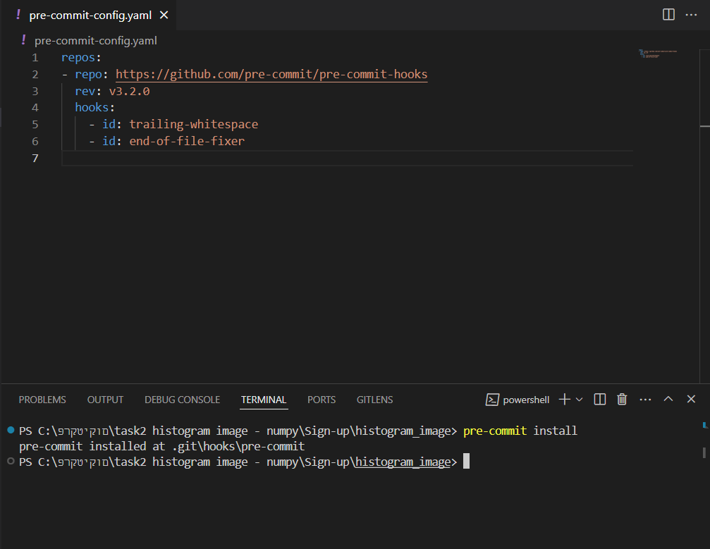
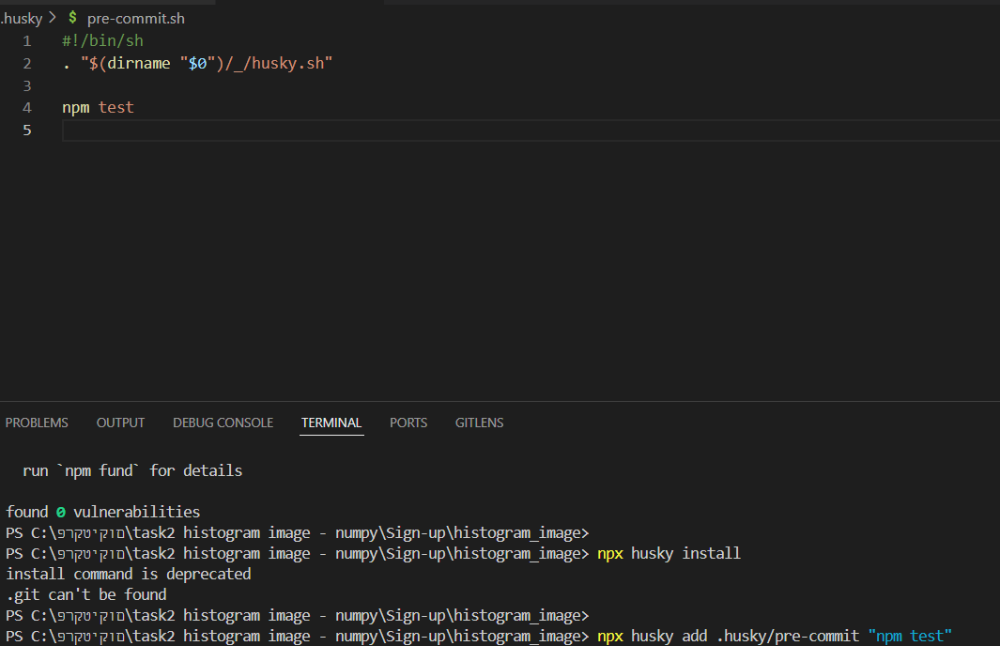
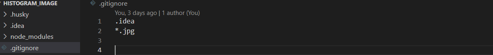
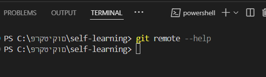
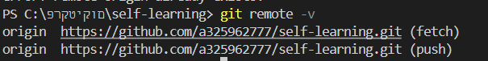
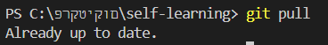
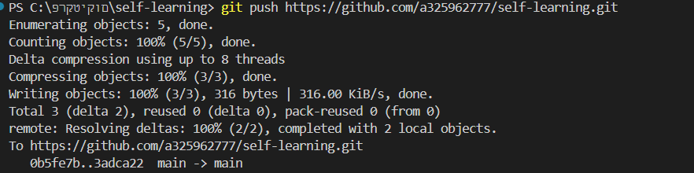
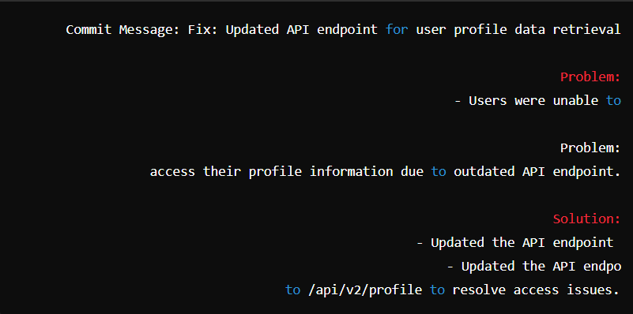
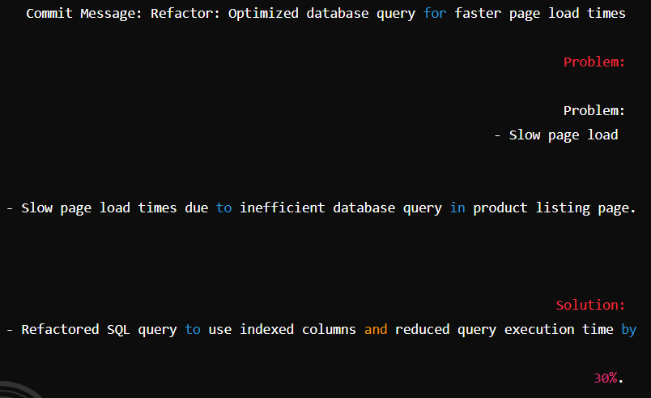
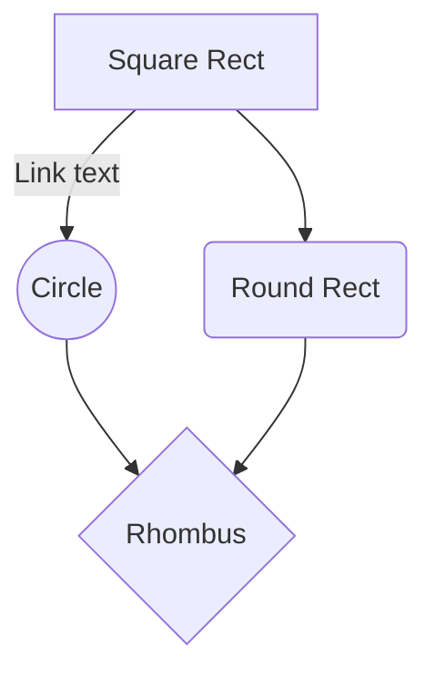

# Git Command :
#   pre-commit :


## description 
Pre-commit is a hook in Git, which is a powerful version control system widely used for tracking changes in source code during software development. A pre-commit hook is a script that runs automatically every time you try to make a commit in Git. Its primary function is to inspect and potentially reject changes that do not meet certain criteria before they are committed to the repository.


---


##  Use-Cases  
###  Basic Use-Case
  - **Code Formatting**: Automatically format code to follow style guidelines.
  - Example: Running `prettier` to format JavaScript code.


  ---


### Advanced Use-Cases
- **Linting**: Ensure code quality by running linters like ESLint for JavaScript or Pylint for Python.
- **Running Tests**: Execute unit tests to make sure new changes don't break existing functionality.
- **Security Checks**: Run security tools to detect vulnerabilities before committing.


---


## Pros and Cons
### Pros
- **Consistency**: Ensures code consistency and adherence to standards.
- **Quality Control**: Prevents commits that don't meet quality checks.
- **Automation**: Reduces manual checks by automating the validation process.


---


### Cons
- **Slower Commits**: Can slow down the commit process if the hooks run long tasks.
- **Complexity**: Managing and maintaining pre-commit hooks can add complexity to the development workflow.


---


## Coding Examples
### Setting Up a Pre-Commit Hook
 Create a file named `pre-commit` in the `.git/hooks` directory of your repository:

 
```sh
#!/bin/sh
# Run ESLint before committing
eslint .
if [ $? -ne 0 ]; then
  echo "ESLint failed. Commit aborted."
  exit 1
fi -->
```


---


## Alternatives
### Pre-commit Framework
A framework for the management and maintenance of hooks with many languages ​​in advance that allows you to manage the hooks in a version-controlled file.

### Example:
### 1. .pre-commit-config.yaml
Activating hooks in a convenient and orderly way using a YAMEL file that defines the desired hooks and rules.

repos:
- repo: https://github.com/pre-commit/pre-commit-hooks
  rev: v3.2.0
  hooks:
    - id: trailing-whitespace
    - id: end-of-file-fixer
### An actual example of running the hook in practice


### 2. Git Hooks Manager
Tools like Husky for JavaScript projects
Manage Git hooks with ease in projects using npm.

npm install husky --save-dev
npx husky install
npx husky add .husky/pre-commit "npm test"
### An actual example of running the hook in practice


 ---

 #   .gitignore :


## description 
.gitignore is a configuration file in Git that allows you to define which files and folders to ignore during versioning. The purpose of this file is to prevent tracking of files that should not be part of the repository and have no dependencies on them, such as local configuration files, temporary files, and binary folders. The file contains a list of patterns that define which files or folders to ignore.


---


##  Use-Cases  
###  Basic Use-Case
  - **Ignoring temporary files**: like `*.tmp` or `*.log`.
```plaintext
  *.tmp
  *.log
  ```
- **Ignoring local configuration files**: like `.env`,`config.yaml`


  ---


### Advanced Use-Cases
- **Ignoring working folders**: like `node_modules/` or `vendor/.`
- **Ignoring files created by certain tools**: like `.idea` or `.vscode`


---


## Pros and Cons
### Pros
- **Keeping the database clean**: Preventing contamination of the database with unnecessary files.
- **Automation**: Saves time by eliminating the need to add each file manually.
- **Simplicity and flexibility**: Easy to set up and use for all types of files.


---


### Cons
- **Regular maintenance is required**: The file must be updated over time according to changes in the project.
- **Limited capabilities**: Dynamic behavior based on conditions cannot be defined.


---


## Coding Examples
- **Ignoring temporary files and binaries**
   - *.tmp
   - *.log
   - *.exe
   - *.dll
- **Ignoring local configuration files**
   - .env
   - config.yaml
- **Ignoring work folders**
   - node_modules/
   - vendor/
-**Ignoring files in subfolders at any depth level**
   - **/debug.log


---


## Alternatives
 - **.git/info/exclude**: This file works like .gitignore, but only affects the local computer and is not stored in the repository.
 - **Configuration management tools**: Tools like EditorConfig that can help keep certain files out of the loop.
 - **Git hooks**: Pre-commit hooks can be used to ensure that unnecessary files do not enter the repository.
### Example:

### An actual example of actually running a gitignore file



 ---


 #   git remote :


## description 
git remote mainly refers to the possibility to manage and duplicate links to external code repositories in the git management system (Git). With the help of the "git remote" commands, you can add, remove, change and manage the links to these external code repositories. It allows development teams to collaborate, access code remotely, and manage the development process in an efficient and organized manner.


---


##  Use-Cases  
###  Basic Use-Case
  - **Cloning Repositories**: Use git remote to add a remote repository URL when cloning a repository.
  - Example: git clone <repository-url>


  ---


### Advanced Use-Cases
- **Collaboration**: Managing collaborative workflows by adding and managing multiple remotes for fetching, pushing, and pulling changes.
- **Forking**: Forking repositories on platforms like GitHub and setting up remotes to track upstream changes.
- **Deployment**: Deploying code to production or staging environments by pushing changes to remote servers.


---


## Pros and Cons
### Pros
- **Flexibility**: Enables working with multiple remote repositories simultaneously.
- **Collaboration**:  Facilitates team collaboration by allowing easy sharing and syncing of code.
- **Deployment**: Essential for deploying applications and managing different deployment environments.


---


### Cons
- **Complexity**: Managing multiple remotes can lead to confusion or errors if not handled carefully.
- **Dependency**: Relies on network connectivity and permissions for remote operations.


---


## Coding Examples
 - **Adding a Remote**
 ```sh
 git remote add origin <remote-url>
```
 - **Listing Remotes**
 ```sh
 git remote -v
```
 - **Renaming a Remote**
 ```sh
 git remote rename origin upstream
```

 
---


## Alternatives
 - **HTTPS vs. SSH URLs**
   Different ways to specify remote URLs based on authentication preferences (HTTPS for username/password, SSH for SSH keys).
 - **Git Submodules**
   For including one Git repository as a subdirectory of another Git repository, managing dependencies across repositories.
 - **Third-party Git Hosting Services**
   Utilizing platforms like GitLab, Bitbucket, or Azure DevOps for hosting Git repositories with integrated remote management features.


   ---


### Example:
   - **By running this command:**
       

       #### Redirect to this address - repository to git remote:
      file:///C:/Program%20Files/Git/mingw64/share/doc/git-doc/git-remote.html
   - **By running this command:**
       
     #### The result is the display of all the remotes linked to the pool:
       


 ---


#   git pull :


## description 
git pull is a Git command used to update the local repository with the latest changes from the remote repository. The command combines two operations: git fetch, which fetches the changes from the remote repository, and git merge, which merges these changes into the current local branch. The command is to ensure that your local code is up to date with the latest code found in the remote repository.


---


##  Use-Cases  
###  Basic Use-Case
  - **Updating Local Repository**: The primary use of git pull is to update the local repository with the latest chang
    - **Example**:  Running git pull origin main to fetch and mermain branch of the remote repository.


  ---


### Advanced Use-Cases
- **Automated Sync**: Integrating git pull in a CI/CD pipeline to ensure the latest code
- **Collaborative Development**: In a team environment, using git pull to frequently update the local repository with changes made
- **Rebasing Instead of Merging**:  Using git pull --rebase to rebas

---


## Pros and Cons
### Pros
- **Easy Updates**: Simplifi
- **Combines Fetch and Merge**: Combines the functionality of `git fgit fetch and git merge into a single command.
- **Streamlined Workflow**: Improves the efficiency of collaborative development by keeping local repositories u


---


### Cons
- **Automatic Merge Conflicts**: If there are conflicts between the local and remote changes, they need to be resolved manuall
- **Implicit Behavior**: The automatic merge behavior may sometimes lead to unexpected results if not used carefully.
- **Dependency on Network**: Requires a stable network connection to interact with the remote repository.


---


## Coding Examples
- **Pull latest changes from the remote repository's main branch**
```sh
   git pull origin main
   ```
- **Pull latest changes and rebase local commits on top of the remote changes**
```sh
   git pull --rebase origin main
   ```
- **Pull latest changes and handle conflicts if any**
```sh
git pull origin main
```
- **In case of conflicts, resolve them manually**
- **After resolving conflicts, complete the merge**
```sh
git add .
git commit -m "Resolved merge conflicts"
```


---


## Alternatives
 - **git fetch + git merge**: Fetches the latest changes from th
 ```sh
 git fetch origin
 git merge origin/main
```
 - **git rebase**: Reapplies local commits on top
 ```sh
 git fetch origin
 git rebase origin/main
```
 
 ---


### Example:

### An actual example of actually running a git pull commsnd



 ---


#   git push :


## description 
git push is a Git command used to push the contents of a local repository to a remote repository. It moves your commits from your local computer to a remote repository like GitHub, GitLab, or Bitbucket, so your changes are available to others.


---


##  Use-Cases  
###  Basic Use-Case
  - **Uploading Changes**: Afte
    - **Example**:  `git push origin main uploads` changes from the local main branch to the remote repository.


  ---


### Advanced Use-Cases
- **Pushing to a Specific Branch**: When working wi
  - **Example**: git push origin feature-branch pushes changesfeature-branch to the remote repository.
- **Force Pushing**: Overwrites the remote branch with your local branch. Use
  - **Example**: `git push --force origin main`
- **Pushing Tags**:  Uploads tags to the remote repository
  - **Example**: `git push origin v1.0.0`


---


## Pros and Cons
### Pros
- **Collaboration**: Allows multiple developers to work on the same project by sharing changes.
- **Backup**: Provides a remote backup of your code.
- **Continuous Integration**: Facilitates automated workflows and continuous integration by ensur


---


### Cons
- **Overwrite Risks**: Force pushing can overwrite other developers' changes.
- **Conflicts**: Pushing changes without pulling the latest changes from


---


## Coding Examples
- **Basic Push**: Pushes changes from your local main branch to the remote main branch.
```sh
   git push origin main
   ```
- **Force Push**: Forces the changes from your local main branch to overwrite the remote main branch
```sh
   git push --force origin main
   ```
- **Push a Specific Branch**: Pushes the feature-branch to the remote repository.
```sh
git push origin feature-branch
```
- **Push**: Pushes the tag v1.0.0 to t
```sh
git push origin v1.0.0
```


---


## Alternatives
 - **git pull**: Combines `git fetch` and `git merge` to update your local branch with chang
 - **git fetch**: Downloads objects a
 
 ---


### Example:

### An actual example of actually running a basic git push commsnd



 ---


#   git fetch :


## description 
git fetch is a command in Git that downloads the commits, files and references from the remote repository to your local repository, without integrating them into the current working branch. This updates the remote-tracking branches but leaves the local branches unchanged. This way you can see the changes made by others without affecting your current work.


---


##  Use-Cases  
###  Basic Use-Case
  - **Syncing with Remote Repository**: `git fetch` is used to update your local repository with the latest changes from the remote repository without merging them into your current branch.
    - **Example**:  `git fetch origin` to fetch updates from the `origin` remote.


  ---


### Advanced Use-Cases
- **Reviewing Changes**: Before merging changes into your working branch, you can use `git fetch` to review and understand what changes have been made on the remote.
  - **Example**: `git fetch --all` to fetch updates from all configured remotes.
- **Creating Local Branches from Remote Branches**:  After fetching, you can create local branches based on the remote branches to work on specific features or fixes.
  - **Example**: `git fetch origin` followed by `git checkout -b new-branch origin/new-branch`.
---


## Pros and Cons
### Pros
- **Non-Destructive**: Fetching does not alter your working directory or the state of your current branch, allowing safe updates.
- **Up-to-Date Awareness**: Keeps your repository updated with the latest changes from the remote, ensuring you are aware of any new commits.


---


### Cons
- **No Immediate Integration**: Fetching alone does not merge or rebase the changes into your working branch, which requires additional commands like `git merge` or `git rebase`.
- **Potential for Confusion**: Beginners might find it confusing as it does not provide immediate visible changes in the working branch.


---


## Coding Examples
- **Basic fetch from the origin remote**
```sh
   git fetch origin
   ```
- **Fetch updates from all remotes**
```sh
   git fetch --all
   ```
- **Fetch a specific branch from the remote**
```sh
git fetch origin feature-branch
```


---


## Alternatives
 - **git pull**: Combines `git fetch` and `git merge` to fetch the latest changes from the remote repository and merge them into your current branch.
  - **Example**:  `git pull origin main` to fetch and merge changes from the `main` branch.
 
 
 ---


### Example:

- ### An actual example of actually running a git fetch commsnd

 - ### An actual example of actually running a git fetch --all commsnd


 ---


#   git stash :


## description 
git stash is a command in Git that allows you to temporarily save uncommitted changes to your work so that you can switch to other branches or perform other tasks without losing your current work. When you stash, the changes are saved in a temporary repository that can be accessed later and reapplied to your workspace.


---


##  Use-Cases  
###  Basic Use-Case
  - **Saving Uncommitted Changes Temporarily**: Sometimes you need to switch branches but have uncommitted changes. `git stash` allows you to save these c
    - **Example**:  You are working on a feature branch but need to switch to the main branch to fix a critical bug. 


  ---


### Advanced Use-Cases
- **Stashing Specific Files**: You can stash changes from specific files instead of stashing all changes.
  - **Example**: `git stash push -m "Stash specific file" path/to/file`
- **Stashing with Untracked Files**: y default, `git stash` does not stash untracked files. You can include untracked files with the `-u` option.
  - **Example**: `git stash push -u`
- **Applying Stash with Conflict Resolution**:   If applying a stash results in conflicts, you can manually resolve the conflicts and then complete the stash application.


---


## Pros and Cons
### Pros
- **Flexibility**:  Allows temporary saving of changes, making it easy to switch branches without committing incomplete work.
- **Organization**: 
- **Efficiency**: Quickly stash and apply changes, saving time when switching contexts.


---


### Cons
- **Complexity**: Managing multiple stashes can become complex, especially when stashes contain changes from different contexts.
- **Risk of Data Loss**:  If not used carefully, there is a risk of losing stashed changes, especially if the stash is accidentally dropped or conflicts are not resolved properly.


---


## Coding Examples
- **Stash Changes**: Explanation: This command stashes your uncommitted changes.
```sh
   git stash
   ```
- **List Stashes**: Explanation: This command lists all the stashes.
```sh
   git stash list
   ```
- **Apply Stash:**: Explanation: This command applies the most recent stash to your working directory.
```sh
git stash apply
```
- **Stash a Specific File**: Explanation: This command stores a file of changes only
```sh
git stash push -m "Stashing specific file" path/to/file
```


---


## Alternatives
 - **Branching**: Instead of stashing, you can create a new branch for your changes.
 ```sh
 git checkout -b new-branch
```
 - **Commit and Revert**: Commit your changes and revert them after switching branches.
 ```sh
 git commit -m "Temporary commit"
```
followed by
 ```sh
 git revert HEAD
 ``` 
 after switching back.

 
 ---


### Example:

### An actual example of actually running a git stash commsnd
Indicates that there are no changes to stash at this time. This means that no files have been changed since the start of your branch or since your last commit on that branch


 ---


#   commit message :


## description 
The commit message is the message that explains the changes made to the particular commit in the Git version control system. It serves as a short and precise summary that explains what the purpose of the change was, why it was required and even what the solution or correction was made.


---


##  Use-Cases  
###  Basic Use-Case
  Brief name and description of the primary code change.


  ---


### Advanced Use-Cases
Explanation of advanced uses such as documenting explained code, bug fixes, or adding new features.

---


## Pros and Cons
### Pros
Assists teams in code maintenance and development, provides quick understanding and tangible documentation of the change.


---


### Cons
If not written clearly or accurately, it can lead to confusion or lack of consistency.


---


## Coding Examples
```plaintext
Fix: Corrected issue with login validation

- Added additional checks for email format.
- Fixed error handling for password mismatch.
```


---


## Alternatives
 Other methods for documenting changes, such as detailed documentation files, project management systems, or other version control systems.

 
 ---


### Example:

### Examples of commit messages as seen on the screen include a description of the change, the problem addressed, and the proposed solution




 ---


#   Advanced Markdown: Mermaid and Math :


## description 
Advanced Markdown refers to the use of Markdown syntax extensions beyond basic design, such as incorporating mermaid diagrams and mathematical notation.


---


##  Use-Cases  
###  Basic Use-Case
  - **Flowcharts and Diagrams (Mermaid)**: Creating complex diagrams and flowcharts directly in
  - **Mathematical Notation (Math)**: Writing mathematical formulas and equations 

  ---


---


## Pros and Cons
### Pros
- **Enhanced Visual Representation**: Mermaid
- **Integration with Technical Documentation**: Useful
- **Mathematical Clarity**: Math notation improves the readability and clarity of mathematical content in Markdown.


---


### Cons
- **Learning Curve**: Mermaid syntax may require learning for those unfamiliar with diagramming tools and graph markup conventions, but it offers powerful capabilities for visual representation in Markdown documents.
- **Rendering Issues**:  
Compatibility issues can arise across different Markdown editors and platforms, potentially affecting the accurate display of Mermaid diagrams.

---


## Coding Examples


```sh

```sh
$$
E = mc^2
$$
```


---


## Alternatives
 - **Mermaid Alternatives**: Draw.io, Lucidchart.
 - **Math Alternatives**: LaTeX (for complex equations), ASCII Math.

 
 ---


### Example:


 

